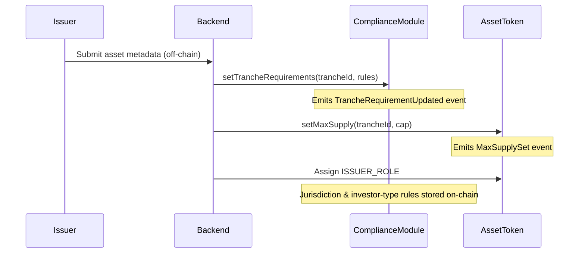
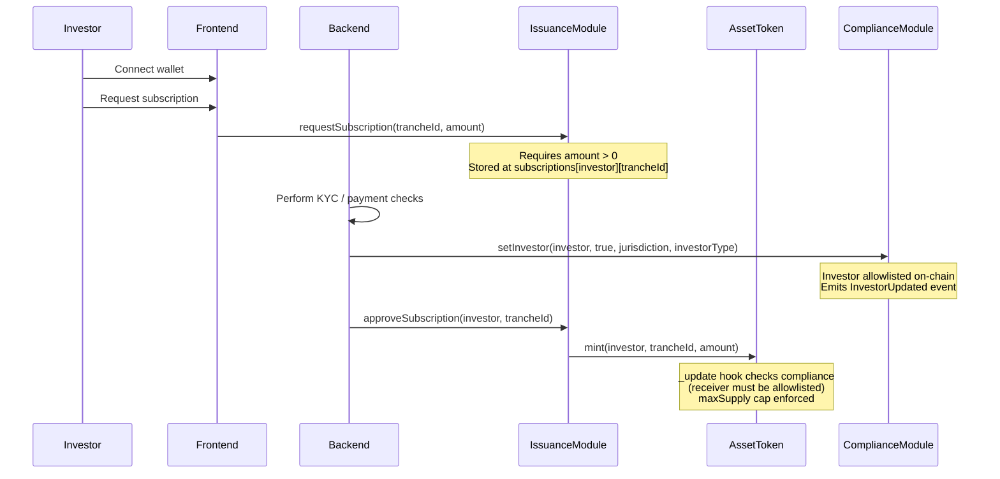
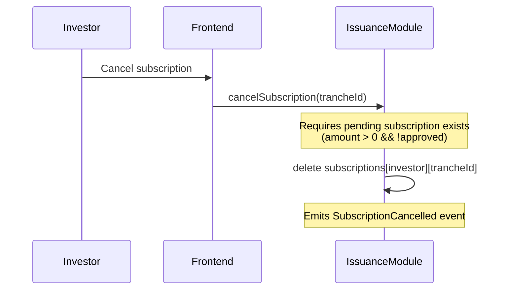
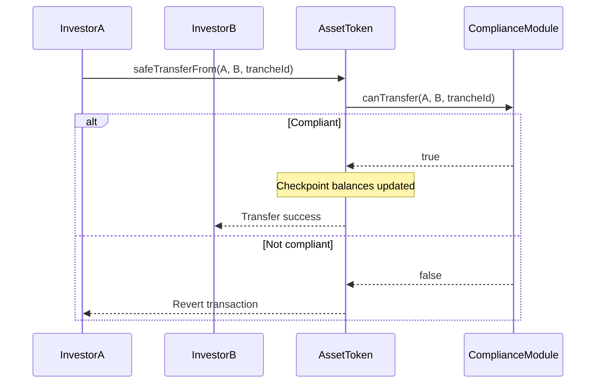
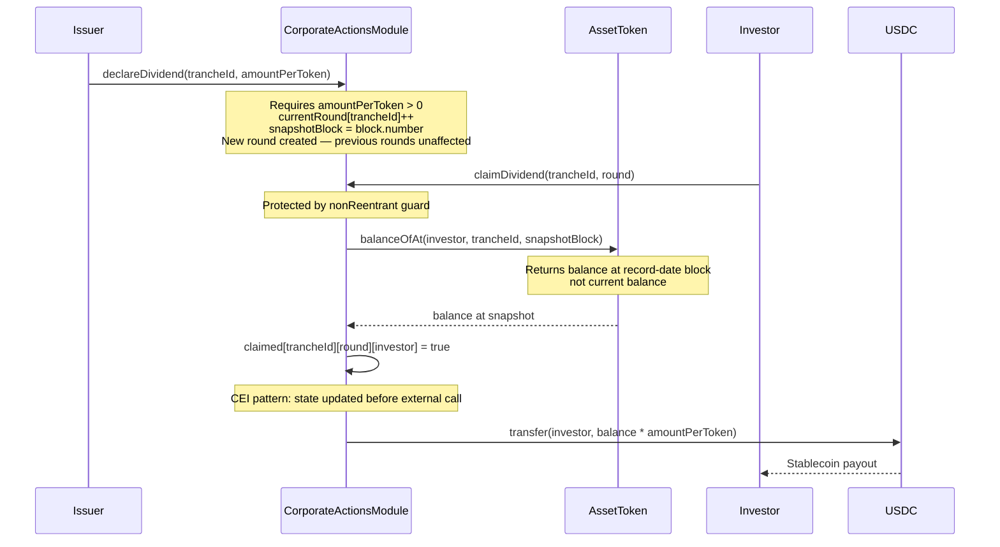
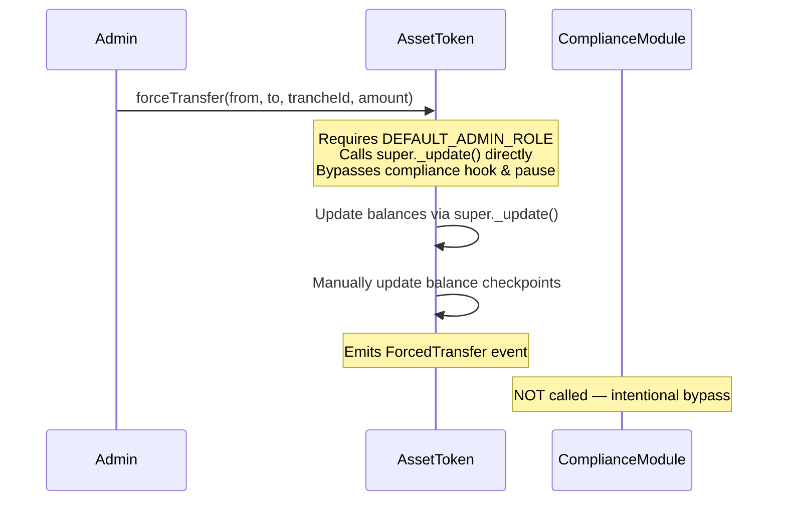
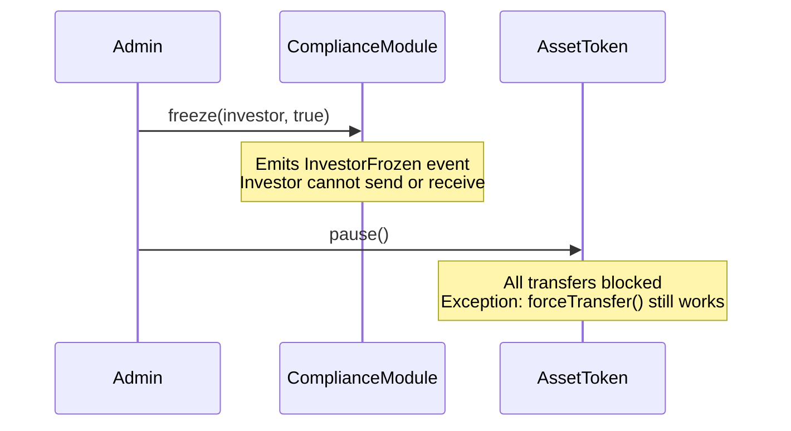
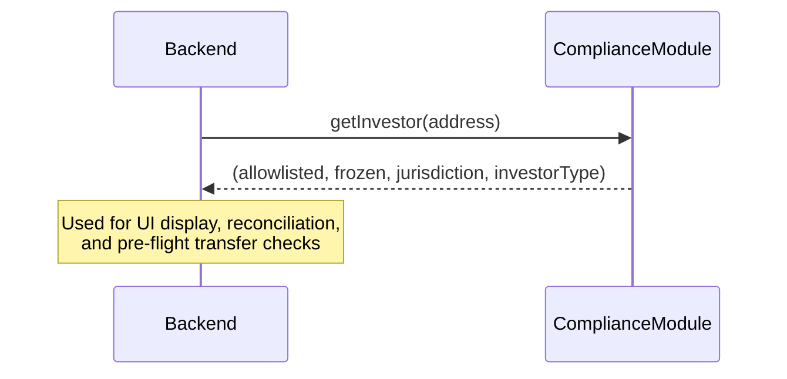

# Sequence Diagrams
----

### Asset Onboarding & Tranche Setup

### Investor Onboarding & Primary Subscription
#### Investor subscribes, issuer approves, tokens are minted.

### Subscription Cancellation
#### Investor cancels a pending (unapproved) subscription.

### Secondary Transfer With Compliance Enforcement
#### Enforce allowlist, jurisdiction, and freeze rules on-chain.

### Corporate Action – Dividend Distribution (Claim-Based, Snapshot)

#### Epoch-based rounds with snapshot balances — no holder iteration required

### Forced Transfer (Regulatory Intervention)
#### Admin-initiated transfer that bypasses compliance and pause checks.

### Emergency Control – Freeze & Pause
#### Operational safety during incidents.

### Investor Data Query
#### Backend or frontend queries on-chain compliance data.

---
